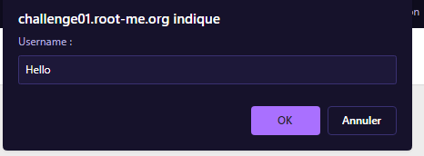

# Web-Client

Web - Client solution du site www.root-me.org

# Solution :

# Web-Client

Web - Client solution du site www.root-me.org

# Réponse :

Le but de ce challenge est de retrouver les identifiants pour se connecter : 
 

Tout d'abord, on va regarder le code source de la page :

On cherche le code du formulaire de connexion :  

On remarque que le formulaire est en POST et qu'il y a un script en javascript, pour le retrouver, on va aller dans la zone `Source` de notre navigateur :  

Une fois le script trouvé, on va le regarder on a qu'a regarder le mot de passe et l'identifiant :  

Voila, on a trouvé le mot de passe et l'identifiant il ne vous reste plus qu'a valider le challenge avec le mot de passe trouvé :  

## License

All right reserved to CTF-STI2D
