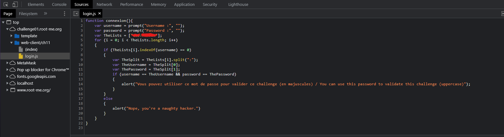
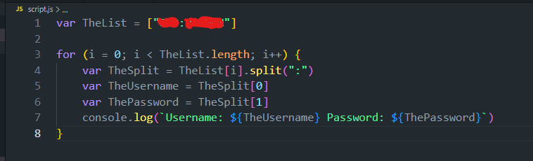

# Web-Client

Web - Client solution du site www.root-me.org

# Solution :

# Web-Client

Web - Client solution du site www.root-me.org

# Réponse :

Dans ce challenge, on demande un identifiant et un mot de passe. On va donc regarder dans le code source de la page.
 

On va directement voir dans la section `source` du code source de la page

On voit donc un fichier login.js qui contient un script javascript. On va donc regarder ce script.

Pour résoudre ce script, vous pouvez utiliser le fichier `script.js` qui est dans ce dossier, il vous suffit de le copier dans la console de votre navigateur ou de le copier dans un fichier javascript et de l'executer avec nodejs.

Et voilà, on a notre identifiant et notre mot de passe, on peut donc se connecter et valider le challenge.

## License

All right reserved to CTF-STI2D
