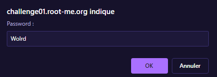

# Web-Client

Web - Client solution du site www.root-me.org,

# Solution :

# Web-Client

Web - Client solution du site www.root-me.org,

# Réponse :
Le but de ce challenge est de trouver le mot de passe caché :

En testant un mot de passe, on obtient une erreur : 

On vas donc regarder le code source de la page, et on trouve le mot de passe (choississez bien `Page source` et pas `Inspectez l'élément` : 

On obtient donc le code complet de la page, et on trouve le mot de passe : 

Il ne reste plus qu'à le rentrer dans le formulaire et a valider le challenge : 

## License

All right reserved to CTF-STI2D,
